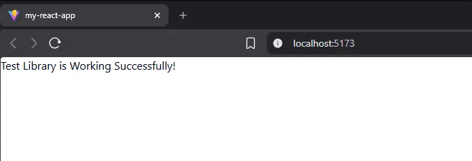
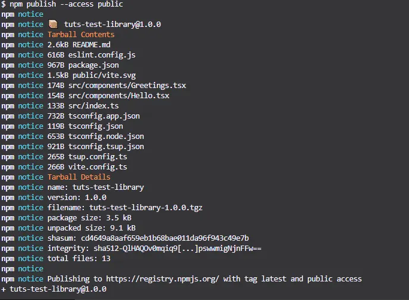
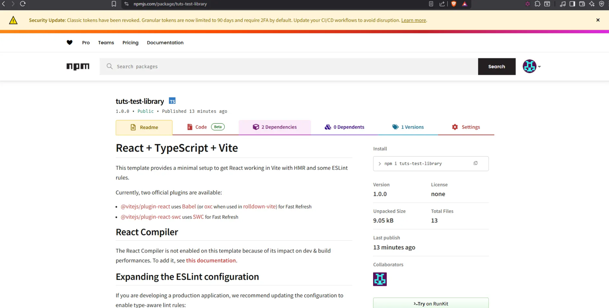

# Building a Library using React 19 Library with Vite, Tsup, and PNPM
This guide details how to scaffold, configure, build, and publish a React 19 component library using TypeScript, Vite, and Tsup.
___

## STACK
- React 19
- Typescript
- Vite
- Tsup


### 1. Initial Setup
- Initialize the project using the Vite React-TypeScript template and clean up default files.

```bash
# Create project
npm create vite@latest test-library -- --template react-ts

# Navigate to directory
cd test-library

# Install dependencies (ensure you are using pnpm)
pnpm install

# Remove default boilerplate
rm -rf src/* rm index.html
```

### 2. Install & Configure Tsup
- Install tsup as a development dependency.

```bash
pnpm add -D tsup
```

##### 2.1 Create `tsconfig.tsup.json`
Create a dedicated TypeScript configuration file for the build process in the root directory.
```json
{
  "extends": "./tsconfig.json",
  "compilerOptions": {
    "tsBuildInfoFile": "./node_modules/.tmp/tsconfig.app.tsbuildinfo",
    "target": "ES2022",
    "lib": ["ES2022", "DOM", "DOM.Iterable"],
    "module": "ESNext",
    "declaration": true,
    "emitDeclarationOnly": true,
    "declarationDir": "dist",
    "noEmit": false,
    "types": ["vite/client"],

    /* Bundler mode */
    "jsx": "react-jsx",
    "moduleResolution": "bundler",
    "verbatimModuleSyntax": true,
    "moduleDetection": "force",
    
    /* Linting */
    "strict": true,
    "noUnusedLocals": true,
    "noUnusedParameters": true,
    "erasableSyntaxOnly": true,
    "noFallthroughCasesInSwitch": true,
    "noUncheckedSideEffectImports": true
  },
  "include": ["src"],
  "exclude": ["node_modules", "dist"]
}
```

##### 2.2 Create `tsup.config.ts`
Create the configuration file for the Tsup bundler in the root directory.

```ts
import { defineConfig } from 'tsup';

export default defineConfig({
    entry: ['src/index.ts'],
    format: ['esm', 'cjs'],
    dts: true,
    clean: true,
    sourcemap: true,
    external: ['react', 'react-dom'],
    tsconfig: "tsconfig.tsup.json" 
});
```

### 3. Configure Vite
Update `vite.config.ts` to handle path resolution. This ensures Vite can resolve absolute paths (like `@/`) correctly during development.

```ts
import { defineConfig } from 'vite'
import react from '@vitejs/plugin-react'
import path from 'path';

// https://vite.dev/config/
export default defineConfig({
  plugins: [react()],
  resolve: {
    alias: {
      '@': path.resolve(__dirname, 'src')
    }
  }
})
```

### 4. Configure Package.json
Modify `package.json` to define entry points, scripts, and peer dependencies.

> **Note:** 
> Comments are not allowed in actual JSON files. Do not copy the comments starting with //.

```json
{
  "name": "tuts-test-library", // change to your prefered library name
  "private": false, // remove or change it to false
  "main": "./dist/index.cjs", // add this 
  "module": "./dist/index.js", // add this 
  "types": "./dist/index.d.ts", // add this
  "version": "1.0.0",
  "type": "module",
  "scripts": {
    "dev": "tsup --watch --sourcemap", // add this 
    "build": "tsup", // add this
    "lint": "eslint .",
    "preview": "vite preview"
  },
   "files": [
    "dist"
  ],
  "dependencies": {
    "react": "^19.2.0",
    "react-dom": "^19.2.0"
  },
  "peerDependencies": { // add this
    "react": "^19.0.0",
    "react-dom": "^19.0.0"
  },
   "publishConfig": { // add this
    "access": "public"
  },
  "devDependencies": {
    "@eslint/js": "^9.39.1",
    "@types/node": "^24.10.1",
    "@types/react": "^19.2.5",
    "@types/react-dom": "^19.2.3",
    "@vitejs/plugin-react": "^5.1.1",
    "eslint": "^9.39.1",
    "eslint-plugin-react-hooks": "^7.0.1",
    "eslint-plugin-react-refresh": "^0.4.24",
    "globals": "^16.5.0",
    "tsup": "^8.5.1",
    "typescript": "~5.9.3",
    "typescript-eslint": "^8.46.4",
    "vite": "^7.2.4"
  }
}

```

### 5. Add Components
Create your library components and export them

##### 5.1 Create `src/components/Hello.tsx`

```tsx
function Hello() {
  return (
    <div>Test Library is Working Successfully!</div>
  )
}

export default Hello
```

##### 5.2 export the component in `src/index.ts`

```tsx
export { default as Hello } from './components/Hello'
```

### 6. Build and Test Locally

Run the build script to generate the `dist` folder.

```bash
pnpm build
```

##### 6.1 Link Locally
To test the library in another local application:

```bash
In your library folder run:
pnpm link
```

To check if the library is linked:

```bash
pnpm ls -g --depth=0
``` 

##### 6.2 Install the library in consumer application
In your consumer application folder run:

```bash
pnpm link tuts-test-library # change to your actual library name
```

Run your consumer application and import the component to test.

```tsx
pnpm dev
```

```tsx
import { Hello } from 'tuts-test-library'; // change to your actual library name

function App() {
  return <Hello />
}

export default App
```

TA-DA! 🎉🎉🎉🎉


***
## PUBLISH THE LIBRARY IN [NPMJS](https://www.npmjs.com/)
***

### 1. Publishing to NPM

In your terminal, run:
```bash
npm login
```
_Follow the prompts for Username, Password, Email, and OTP._

### 2. Once Successfully Logged in, Publish the Library
Run the publish command:
```bash
npm publish --access public
```

If you get an error:

> **NOTE:**
> If you receive a 403 error regarding 2FA or Granular Access Tokens:
> 1. Go to NPM Settings > Access Tokens.
> 2. Click Generate New Token.
> 3. Select Granular Access Token.
> 4. Set Permissions to Read and Write (Publish).
> 5. Select your specific package (or all packages).
> 6. Copy the generated token string.
> // **you have to create organization if you don't have one.**

- 403 error regarding 2FA or granular access tokens—looks like this.


### 3. Set Token 
- after successful creation of token, set the token in your terminal.

```bash
npm set //registry.npmjs.org/:_authToken=<YOUR_GENERATED_TOKEN_HERE>
```

Retry to publish the library:
```bash
npm publish --access public
```

TA-DA! 🎉🎉🎉🎉



***
## CONGRATULATIONS 🎉🎉🎉🎉
You have successfully published your React 19 component library to NPMJS.